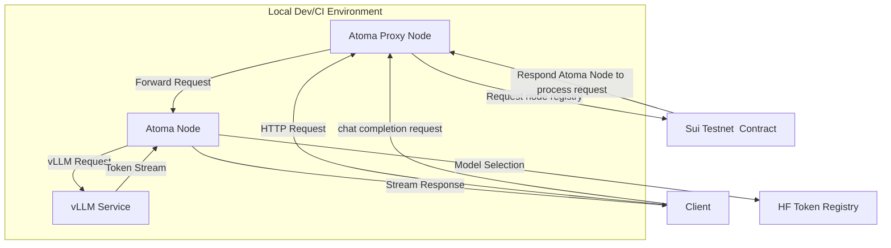

```mermaid
flowchart TD
 subgraph subGraph0["Local Dev/CI Environment"]
        AtomaProxy["Atoma Proxy Node"]
        AtomaNode["Atoma Node"]
        vLLMService["vLLM Service"]
  end
    Client["Client"] -- HTTP Request --> AtomaProxy
    AtomaProxy -- Forward Request --> AtomaNode
    AtomaNode -- Model Selection --> HuggingFace["HF Token Registry"]
    AtomaNode -- vLLM Request --> vLLMService
    vLLMService -- Token Stream --> AtomaNode
    AtomaNode -- Stream Response --> Client
    AtomaProxy -- Request node registry --> n2["Sui Testnet&nbsp; Contract"]
    n2 -- Respond Atoma Node to process request --> AtomaProxy
    Client -- chat completion request --> AtomaProxy

    n2@{ shape: rect}


```